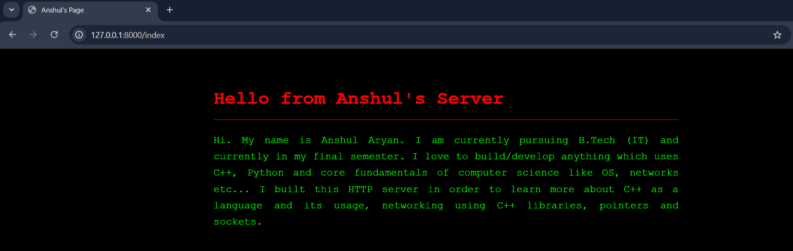

# HTTP-Server: Static file server

## A functioning http-server built in c++ and linux sockets, process GET request to server static file.

This project was developed to gain a deep understanding of the HTTP protocol and the internal mechanics of an HTTP server. It was built from scratch without external libraries or frameworks, relying solely on Linux sockets (such as <sys/socket.h> and <unistd.h>).
Features:
* HTTP Request Parsing: Efficiently handles and interprets incoming requests.
* Static File Serving: Supports serving various file types directly from the server.
* Binary File Support: Capable of handling non-text formats (images, executables, etc.).
* Streaming Architecture: The first packet contains the HTTP header, followed by a stream of raw file bytes for efficient delivery.
* Optimized Routing: Implements hash table-based routing for $O(1)$ lookup performance.
* Robust Error Handling: Built-in support for 400, 404, 405, and 500 status codes.




# How to install and run this project
## Requirements: Linux or wsl, g++ with c++17 support

1. Clone this project
2. open the project directory in a terminal
3. compile using:
```bash
g++ main.cpp http_tcpserver.cpp http_process.cc -o main
```
4. start the server using:
```bash
./main
```
note: The server will work on http://127.0.0.1:8000/ on the same machine.


# Example test requests
1. index page: http://127.0.0.1:8000/ 
2. ERROR 404: http://127.0.0.1:8000/i 
3. ERROR 405(note: This command should run in a different terminal.):  curl --json '{"hello"}' http://127.0.0.1:8000/


# Limitations
1. No multithreading
2. NO MIME type detection
3. Only GET request allowed
4. No keep-alive connections


# Future Roadmap
1. Add MIME type detection
2. POST method handling
3. Improve error handling


# Structure
```bash
.
├── http_tcpserver.h
├── http_process.h
├── http_tcpserver.cpp
├── http_process.cc
├── main.cpp
├── README.md
├── image.png
├── LICENSE
└── path_file/
    ├── index.html
    └── error/
        ├── 400.html
        ├── 404.html
        └── 405.html
```


# LICENSE
This project is licensed under the [MIT License](LICENSE) - see the LICENSE file for details.
